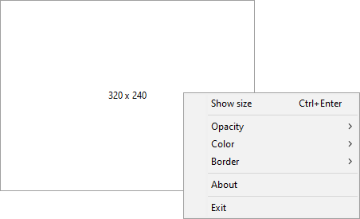

# FnstDimensionatore
An utility to measure screen by pixels. It's a resizable window with the current size in the middle. You can use arrow keys to move it or shift + arrow keys to resize it. Right click on it for other options: set opacity, set colors, set border size.
So simple as so useful, i.e. for web design :-)

Developed with Lazarus.

# Download
Last version can be downloaded from **\output** folder or directly [from here](/output/FnstDimensionatore.exe).

# Donation
If you like my work, please consider making a donation to reward me. I'm a simple developer, and I enjoy simple things: a coffee, a beer, or a pizza... or any amount you feel is right. Thank you in advance!

